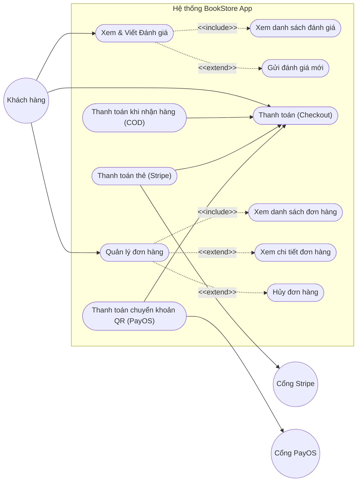
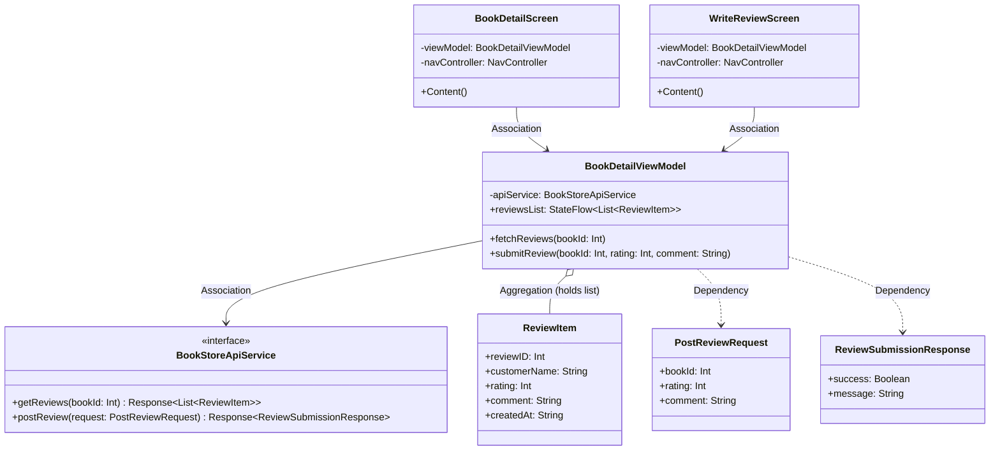
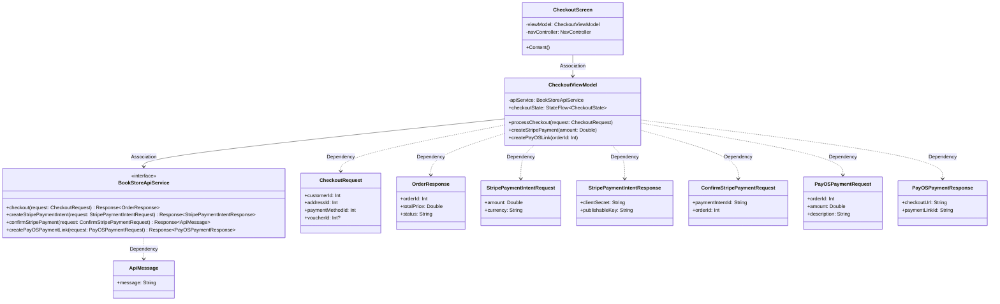
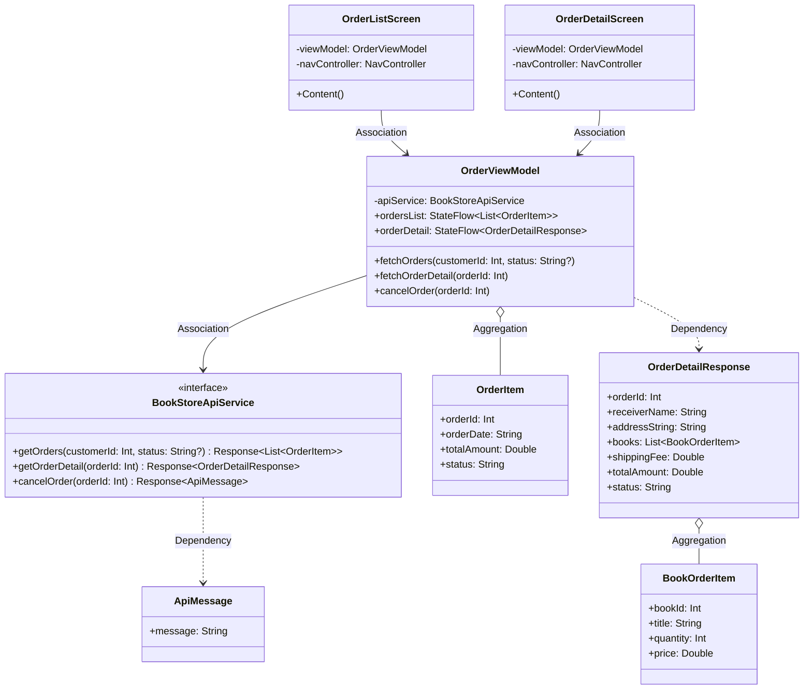
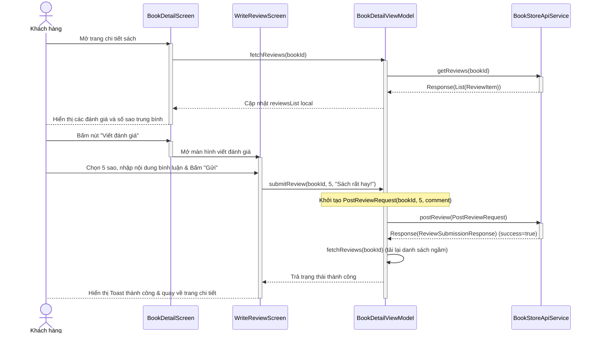
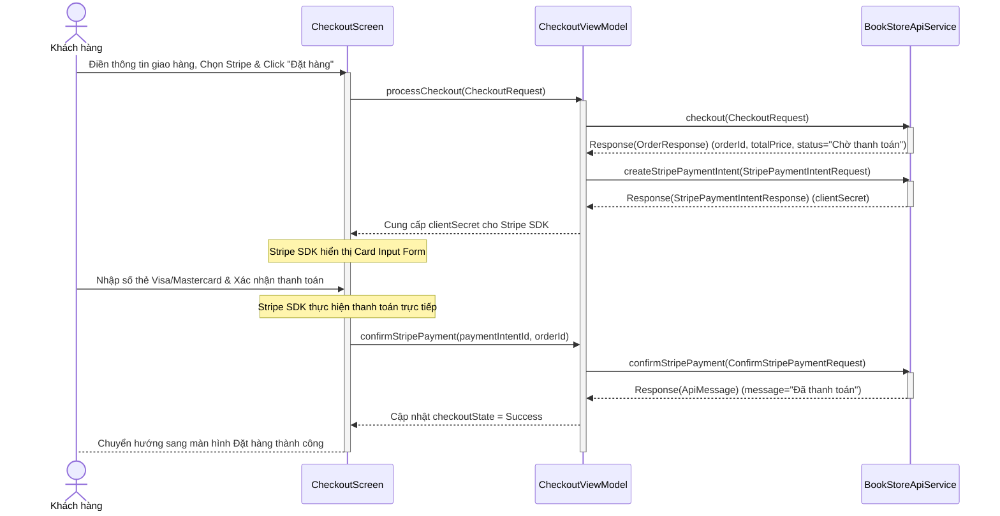
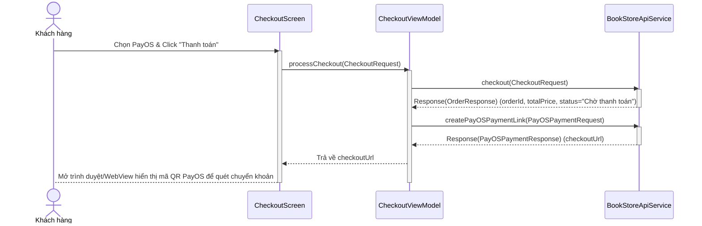
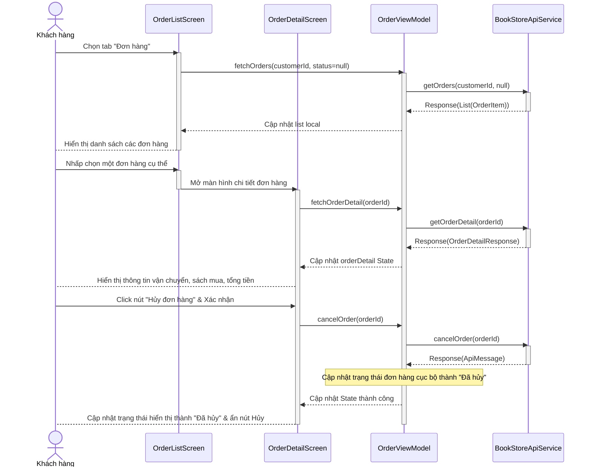

# THIẾT KẾ UML: ĐÁNH GIÁ SẢN PHẨM, THANH TOÁN VÀ QUẢN LÝ ĐƠN HÀNG

Tài liệu này chứa thiết kế chi tiết về **Sơ đồ Use Case**, **Sơ đồ lớp (Class Diagram)** và **Sơ đồ tuần tự (Sequence Diagram)** cho 3 nhóm tính năng nâng cao của ứng dụng di động BookStore:
1. **Đánh giá sản phẩm (Product Review)**
2. **Thanh toán (Checkout & Payment)** - *Chỉ sử dụng COD, Stripe, PayOS (đã loại bỏ cổng VNPay)*
3. **Quản lý đơn hàng (Order Management)**

Các sơ đồ được vẽ bằng công cụ Mermaid Diagram trực quan và tuân thủ các quy tắc thiết kế hệ thống di động (MVVM Client, đối xứng stack kích hoạt, mối quan hệ UML chuẩn hóa).

---

## I. SƠ ĐỒ USE CASE CHI TIẾT (USE CASE DIAGRAM)

Sơ đồ này mô tả sự tương tác giữa Khách hàng, Cổng thanh toán ngoại và các chức năng của ứng dụng.

---

## II. SƠ ĐỒ LỚP CHI TIẾT (CLASS DIAGRAM)

Sơ đồ này biểu diễn cấu trúc các lớp di động theo mô hình MVVM (View - ViewModel - Model/API) và các mối quan hệ UML (`-->` Association, `..>` Dependency, `o--` Aggregation).

### 1. Nhóm Đánh giá sản phẩm (Product Review)

### 2. Nhóm Thanh toán (Checkout & Payment)

### 3. Nhóm Quản lý đơn hàng (Order Management)

---

## III. SƠ ĐỒ TUẦN TỰ CHI TIẾT (SEQUENCE DIAGRAM)
*Vẽ theo mô hình tuyến tính (Happy Path) của Client-side để đảm bảo import mượt mà vào Visual Paradigm.*

### 1. Đánh giá sản phẩm (Xem reviews & gửi đánh giá mới thành công)

### 2. Thanh toán - Cổng thẻ tín dụng Stripe (Đặt đơn & Thanh toán thành công)

### 3. Thanh toán - Cổng chuyển khoản QR PayOS (Đặt đơn & Lấy link QR thành công)

### 4. Quản lý đơn hàng (Xem danh sách, xem chi tiết và hủy đơn thành công)

